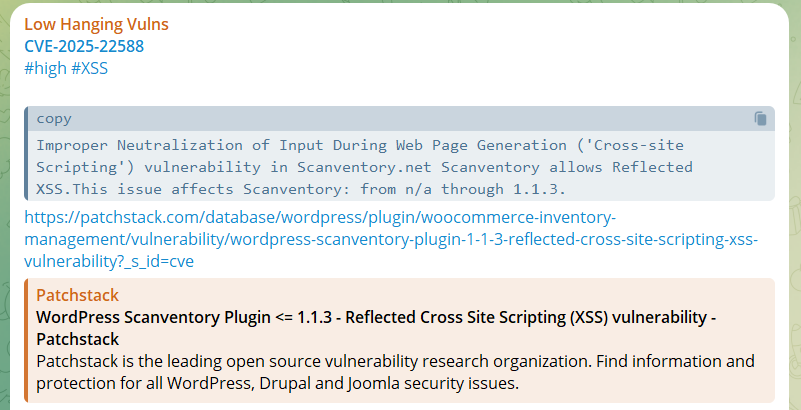

# Low Hanging Vulns

Two automated intelligence feeds for **real-world, low-complexity** vulnerabilities — one
from [NVD](https://nvd.nist.gov/) (critical/high web CVEs) and one from
[HackerOne Hacktivity](https://hackerone.com/hacktivity) (disclosed bug bounty reports).

All findings are published on the Telegram channel 👉 [https://t.me/lowhangingvulns](https://t.me/lowhangingvulns)

## What's inside

| Path | Contents |
|------|----------|
| `nvd/` | NVD CVEs, organised `nvd/{year}/{SEVERITY}/{CVE-ID}/` — each folder holds the raw NVD JSON and a generated `README.md` |
| `bugbounty/H1/reports/` | Full HackerOne report JSONs, organised `{category}/{weakness}/{year}/{id}.json` |
| `bugbounty/H1/reports.json` | Flat stub index of every known disclosed report |
| `bugbounty/H1/reports/**/README.md` | Auto-generated index tables, per weakness class and per category, sorted by bounty |

## Stay updated

Join the Telegram channel for the latest low-complexity, high-impact vulnerabilities:

👉 [https://t.me/lowhangingvulns](https://t.me/lowhangingvulns)

## Data sources

- [National Vulnerability Database (NVD)](https://nvd.nist.gov/)
- [HackerOne Hacktivity](https://hackerone.com/hacktivity)

---

### Contribution

Contributions, feedback, and suggestions are welcome — open an issue or submit a pull request.

### License

This project is open-source and licensed under the [GNU GPL v3](LICENSE).
